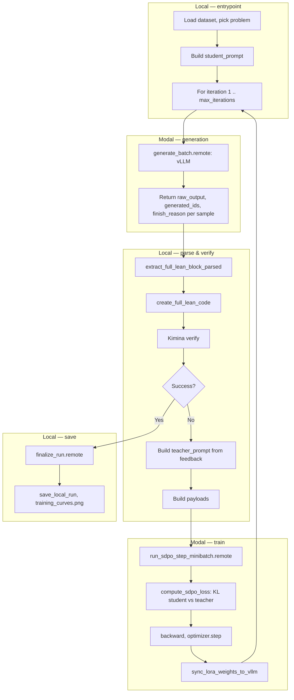

# qwen_sdpo Pipeline — Workflow

End-to-end flow for the **qwen_sdpo** self-distillation pipeline: Qwen 3.5 (4B/9B) with QLoRA on Modal (H100), verification and orchestration on your machine (Kimina Docker).

## Where things run

| Location | Role |
|----------|------|
| **Local** | Load dataset, build prompts, parse output, call Kimina verify, build payloads, save results |
| **Modal (H100)** | vLLM generation + HuggingFace QLoRA training; after each gradient step, LoRA weights are synced into vLLM so the next generation uses the updated policy |

Verification runs **locally** via Kimina (Docker). Start it before running:

```bash
docker run -d -p 8000:8000 projectnumina/kimina-lean-server:2.0.0
```

## High-level flow

```
┌─────────────────────────────────────────────────────────────────────────────┐
│  LOCAL                                                                        │
│  modal_app.run_sdpo() → entrypoint.run_main()                                 │
│  Load problem (HF dataset) → build student_prompt (fixed for run)             │
└─────────────────────────────────────────────────────────────────────────────┘
                                      │
        ┌─────────────────────────────┴─────────────────────────────┐
        │  For iteration = 1 .. max_iterations                        │
        ▼                                                             │
┌───────────────────────────────────────┐                            │
│  MODAL — QwenSDPOTrainer              │                            │
│  generate_batch.remote(prompts)        │                            │
│  → vLLM generates minibatch_size       │                            │
│  → returns (raw_output, generated_ids, finish_reason) per sample    │
└───────────────────────────────────────┘                            │
        │                                                             │
        ▼                                                             │
┌───────────────────────────────────────┐                            │
│  LOCAL                                │                            │
│  For each sample:                     │                            │
│    • parsing.extract_full_lean_block  │                            │
│    • parsing.create_full_lean_code     │                            │
│    • _verifier.verify(full_code)       │  ──► Kimina Docker (HTTP)  │
│    • build teacher_prompt (feedback)   │                            │
│    • build payload (ids, mode, etc.)   │                            │
│  If any success → break                │                            │
└───────────────────────────────────────┘                            │
        │                                                             │
        ▼                                                             │
┌───────────────────────────────────────┐                            │
│  MODAL — QwenSDPOTrainer              │                            │
│  run_sdpo_step_minibatch.remote(payloads)                           │
│  • Skip if success/server_error/truncated                           │
│  • compute_sdpo_loss (HF model): KL(student ‖ teacher)            │
│  • backward, clip_grad, optimizer.step │                            │
│  • sync_lora_weights_to_vllm (in-place)  ← next gen uses new policy│
└───────────────────────────────────────┘                            │
        │                                                             │
        └─────────────────────────────┬─────────────────────────────┘
                                      ▼
┌─────────────────────────────────────────────────────────────────────────────┐
│  MODAL — finalize_run.remote() → save model + logs to volume                 │
│  LOCAL — save_local_run(), plot_training_curves()                             │
└─────────────────────────────────────────────────────────────────────────────┘
```

## End-to-end pipeline (Mermaid)



## Per-iteration detail (student vs teacher)

- **Student prompt**: Problem only (theorem + optional informal + header). Same every iteration; model generates from this at test time.
- **Teacher prompt**: Problem + compiler feedback from the **current** failed attempt (errors only or errors + failed proof, per `feedback_errors_only`). Used only for the KL loss; the model does not generate from it.
- **Generation**: Always from **student_prompt** via vLLM. After each failed attempt, one gradient step moves the policy toward the teacher (feedback-conditioned) distribution; then LoRA is synced into vLLM so the next generation is from the updated policy (online RL).

## Key files

| Component | Path |
|-----------|------|
| CLI / entrypoint | [qwen_sdpo/modal_app.py](../qwen_sdpo/modal_app.py) — `run_sdpo`, `run_sdpo_batch` |
| Local loop | [qwen_sdpo/entrypoint.py](../qwen_sdpo/entrypoint.py) — `run_main`, `run_main_batch` |
| Modal trainer | [qwen_sdpo/modal_trainer.py](../qwen_sdpo/modal_trainer.py) — `QwenSDPOTrainer` |
| Config | [qwen_sdpo/config.py](../qwen_sdpo/config.py) — `SDPOConfig` |
| SDPO loss | [qwen_sdpo/sdpo_loss.py](../qwen_sdpo/sdpo_loss.py) — `compute_sdpo_loss` |
| Parsing | [qwen_sdpo/parsing.py](../qwen_sdpo/parsing.py) — `extract_full_lean_block_parsed`, `create_full_lean_code` |
| Verifier | [qwen_sdpo/_verifier.py](../qwen_sdpo/_verifier.py) — `verify` (Kimina HTTP) |
| Weight sync | [qwen_sdpo/_weight_sync.py](../qwen_sdpo/_weight_sync.py) — LoRA → vLLM in-place |

## Usage

```bash
# Single problem (default: Qwen3.5-4B, problem_idx=0)
python3 -m modal run qwen_sdpo/modal_app.py --model "Qwen/Qwen3.5-4B" --problem-idx 4

# Batch (multiple problems, reset to base between each)
python3 -m modal run qwen_sdpo/modal_app.py::run_sdpo_batch --model "Qwen/Qwen3.5-4B"
```

Output: `sdpo_results/{model_tag}/run_.../` (local) and Modal volume `/output/...`.
