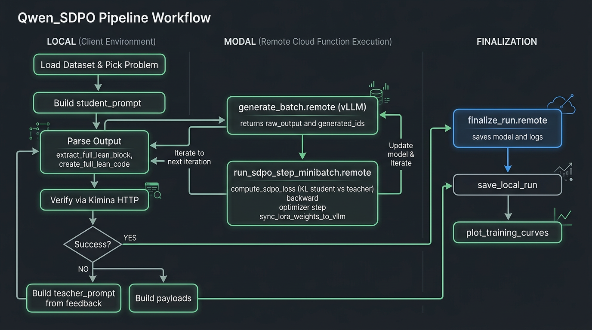

# Test-Time Self-Distillation for Lean Theorem Proving

**TL;DR** — Test-time self-distillation for Lean 4: generate proof attempts, verify with Kimina (or local Lean), use compiler feedback to build a teacher prompt and compute KL loss; gradient updates run on Modal (Qwen 3.5 + QLoRA), with LoRA synced into vLLM after each step so the next generation uses the updated policy.

## Current pipeline: qwen_sdpo

The **main pipeline** is **[qwen_sdpo/](qwen_sdpo/)**: Qwen 3.5 (4B or 9B) with QLoRA on Modal (H100). Generation runs on Modal (vLLM); verification runs **locally** via Kimina Docker; the local driver orchestrates generate → parse → verify → build payload → Modal SDPO step (loss, backward, sync LoRA to vLLM).

**Workflow diagram:** See [QWEN_SDPO_WORKFLOW.md](QWEN_SDPO_WORKFLOW.md) for the full flow (ASCII + Mermaid). Rendered diagram:

```
┌─────────────────────────────────────────────────────────────┐
│                    Test-Time Self-Distillation (qwen_sdpo)   │
├─────────────────────────────────────────────────────────────┤
│  1. LOCAL: Load problem; build student prompt (problem only) │
│                     ↓                                       │
│  2. MODAL: Generate proof attempts (vLLM, minibatch_size)   │
│                     ↓                                       │
│  3. LOCAL: Parse lean4 block → full_code; verify (Kimina)    │
│     If success → done. If failure → extract errors as feedback │
│                     ↓                                       │
│  4. LOCAL: Build teacher prompt (problem + feedback)         │
│                     ↓                                       │
│  5. MODAL: SDPO loss (KL student ‖ teacher), backward, step│
│     Sync LoRA weights into vLLM → next gen uses new policy │
│                     ↓                                       │
│  6. Repeat until success or max_iterations                  │
└─────────────────────────────────────────────────────────────┘
```



### Verification backends

| Backend | Use case | Where used |
|--------|----------|-------------|
| **Kimina** (HTTP) | qwen_sdpo (local Docker) | [qwen_sdpo/_verifier.py](../qwen_sdpo/_verifier.py); start `docker run -p 8000:8000 projectnumina/kimina-lean-server:2.0.0` |
| **Local Lean** (`lake exe repl`) | training/ pipelines | `sdpo_modal_local_verify_goedel`, `sdpo_modal_local_verify_kimina` (see [training/](training/)) |

**Other Modal pipelines** (in [training/](training/)): Kimina 2B, Goedel 8B, Qwen 3B, DeepSeek 7B, and local-verify variants (Goedel, Kimina-Prover with LoRA→vLLM sync). See main [README](../README.md) for links.

## Requirements

**Local test-time only (no Modal):**
```bash
pip install torch transformers kimina-client
```

**Kimina server** (for Kimina-backed pipelines):
```bash
# Using Docker
docker run -d -p 80:80 projectnumina/kimina-lean-server:2.0.0

# Or from source (see setup/kimina-lean-server-setup)
```

**Local Lean verification** (for `sdpo_modal_local_verify*` or `lean_sdpo_local_verify_modal.py`): install [elan](https://github.com/leanprover/elan) and build a mathlib4 workspace (e.g. `Goedel-Prover-main/mathlib4`). See `devlog/20260303_local_lean_verifier_setup.md`. For Kimina-backed local verification (`sdpo_modal_local_verify_kimina`), you can use Kimina Docker instead.

## Usage

**qwen_sdpo (recommended)** — from project root, with Kimina Docker running on port 8000:

```bash
# Single problem (default: Qwen3.5-4B, problem_idx=0)
python3 -m modal run qwen_sdpo/modal_app.py --model "Qwen/Qwen3.5-4B" --problem-idx 4

# Batch (multiple problems; reset to base model between each)
python3 -m modal run qwen_sdpo/modal_app.py::run_sdpo_batch --model "Qwen/Qwen3.5-4B"
```

**Local test-time only** (no Modal; uses `training/lean_sdpo_ttt.py`):

```bash
python training/lean_sdpo_ttt.py --n_problems 5 --n_samples 4 --max_iterations 3
```

## Key components (qwen_sdpo)

### 1. Local orchestration ([qwen_sdpo/entrypoint.py](../qwen_sdpo/entrypoint.py))
- Loads problem from HuggingFace dataset; builds **student_prompt** (problem only).
- Each iteration: calls Modal `generate_batch.remote(prompts)` → for each sample: **parse** ([parsing.py](../qwen_sdpo/parsing.py)), **verify** ([_verifier.py](../qwen_sdpo/_verifier.py) → Kimina), build **teacher_prompt** (problem + feedback), build payload → `run_sdpo_step_minibatch.remote(payloads)`.
- Saves logs and training curves locally; Modal writes model + logs to volume.

### 2. Modal trainer ([qwen_sdpo/modal_trainer.py](../qwen_sdpo/modal_trainer.py))
- **vLLM**: batched generation (student_prompt only).
- **HuggingFace**: QLoRA model for SDPO loss (same weights conceptually; LoRA is trained).
- After each gradient step: **sync_lora_weights_to_vllm** ([_weight_sync.py](../qwen_sdpo/_weight_sync.py)) so the next generation uses the updated policy (online RL).

### 3. Feedback and loss
- **Teacher prompt**: problem + compiler errors (and optionally failed proof) from the **current** attempt only.
- **SDPO loss** ([sdpo_loss.py](../qwen_sdpo/sdpo_loss.py)): KL(student ‖ teacher) on top-K token logits + tail bucket; optional mask over final code block only (`kl_mask_final_code_only`).

## Configuration (qwen_sdpo)

Key parameters in [qwen_sdpo/config.py](qwen_sdpo/config.py) `SDPOConfig`:

| Parameter | Default | Description |
|-----------|---------|-------------|
| `max_iterations` | 5 | Maximum self-correction iterations |
| `learning_rate` | 5e-6 | AdamW learning rate |
| `minibatch_size` | 1 | Samples per iteration (one vLLM batch, one gradient step) |
| `temperature` | 0.6 | Sampling temperature |
| `distillation_topk` | 20 | Top-K logits for KL (+ tail bucket) |
| `feedback_errors_only` | True | Teacher prompt: errors only vs errors + failed proof |
| `teacher_response_mode` | "full_output" | full_output \| answer_only \| code_only (which tokens KL uses) |
| `kl_mask_final_code_only` | False | If True, loss summed only over final lean4 block |

## Output Format

Results are saved as JSON:
```json
{
  "config": {
    "model": "Qwen/Qwen3-1.7B",
    "n_samples": 4,
    "max_iterations": 3,
    ...
  },
  "summary": {
    "n_problems": 5,
    "n_solved": 2,
    "solve_rate": 0.4,
    "total_iterations": 12,
    "total_attempts": 48,
    "elapsed_seconds": 120.5
  },
  "results": [
    {
      "problem_id": "mathd_algebra_478",
      "success": true,
      "best_proof": "simp [h₁, h₂, h₃]\nring",
      "iterations": 2,
      "total_attempts": 8
    },
    ...
  ]
}
```

## Differences from Full SDPO Training

This is a **test-time** self-distillation implementation, which differs from full SDPO training:

| Aspect | Test-Time (this script) | Full SDPO Training |
|--------|------------------------|-------------------|
| Model updates | No gradient updates | Online policy updates |
| Reference model | Frozen copy | EMA-updated teacher |
| KL divergence | Monitoring only | Used in loss function |
| Scale | Single problem | Batch training |

**Full SDPO training on Modal** (Kimina verification):
- `training/lean_sdpo_kimina_2b_modal.py` — Kimina-Prover-RL-1.7B
- `training/lean_sdpo_kimina_distill_1_7b_modal.py` — Kimina-Prover-Distill-1.7B
- `training/lean_sdpo_goedel_8b_modal.py` — Goedel-Prover-V2-8B (LoRA/Unsloth)
- `training/lean_sdpo_qwen_3b_modal.py` / `lean_sdpo_qwen_3b_lora_modal.py` — Qwen 3B
- `training/lean_sdpo_deepseek_7b_modal.py` — DeepSeek 7B

**Local Lean verification** (no Kimina on Modal; verify on your machine or via Kimina Docker):
- `training/lean_sdpo_local_verify_modal.py` — uses `sdpo_modal_local_verify_kimina`; Kimina-Prover-RL-1.7B with QLoRA and **in-place weight sync** to vLLM after each SDPO step (true online RL). Verification can use local `lake exe repl` (elan + mathlib4) or Kimina HTTP. Requires `transformers>=5.2.0`.
- `training/lean_sdpo_goedel_local_verify_modal.py` — uses `sdpo_modal_local_verify_goedel`; Goedel-Prover-V2-8B, local verify only.

The `SDPO/` directory contains the verl framework used for batch training.

## References

- **qwen_sdpo workflow:** [docs/QWEN_SDPO_WORKFLOW.md](QWEN_SDPO_WORKFLOW.md) — flow diagram and file map
- **Deep dive:** [docs/SDPO_TRAINER_DEEP_DIVE.md](SDPO_TRAINER_DEEP_DIVE.md) — qwen_sdpo trainer and loss
- [SDPO Paper (arXiv:2601.20802)](https://arxiv.org/abs/2601.20802)
- [Kimina Lean Server](https://github.com/project-numina/kimina-lean-server)
