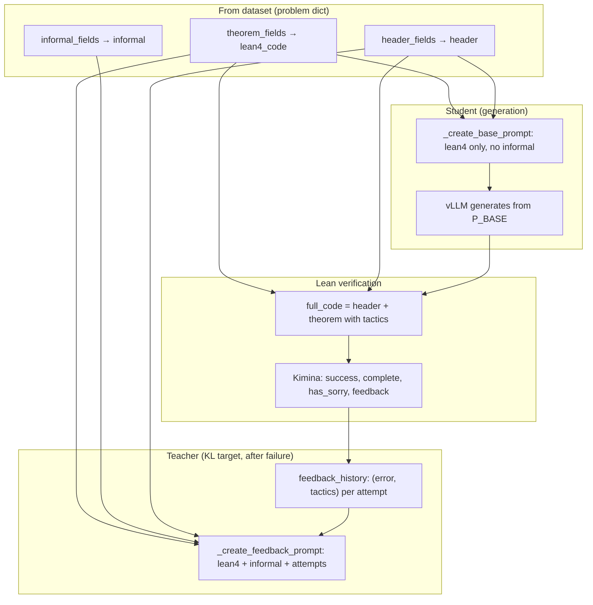

# SDPO Test-Time RL — Current Workflow

End-to-end and per-iteration flow for `lean_sdpo_modal.py` (current code).

---

## High-level: Where things run

```
┌─────────────────────────────────────────────────────────────────────────────┐
│  LOCAL (your machine)                                                         │
│  • main(): load dataset, pick problem, build config_dict                     │
│  • Call trainer.run_sdpo.remote(config_dict, problem)                        │
│  • Receive logs; save local copy to sdpo_results/run_{idx}_{timestamp}/      │
└─────────────────────────────────────────────────────────────────────────────┘
                                      │
                                      ▼
┌─────────────────────────────────────────────────────────────────────────────┐
│  MODAL — SDPOTrainer (GPU A100)                                              │
│  • setup(): load tokenizer, vLLM engine, HF model (no initial_state snapshot)│
│  • run_sdpo(): loop iterations → generate → verify → [optional] SDPO step   │
│  • _save_results(): write to /output (volume); model NOT reset after run     │
└─────────────────────────────────────────────────────────────────────────────┘
                                      │
                    ┌─────────────────┴─────────────────┐
                    ▼                                     ▼
┌──────────────────────────────┐         ┌──────────────────────────────┐
│  MODAL — KiminaLeanServer    │         │  MODAL — LeanVerifier         │
│  (CPU, Lean/Mathlib image)   │         │  (thin wrapper, inference img) │
│  • POST /verify with Lean    │ ◀────── │  • Calls KiminaLeanServer    │
│    code; return results      │         │  • Normalizes → success,      │
│                              │         │    complete, feedback, etc.  │
└──────────────────────────────┘         └──────────────────────────────┘
```

---

## End-to-end pipeline (single problem)

```mermaid
flowchart TB
    subgraph LOCAL["Local (main)"]
        A[Load dataset + pick problem_idx]
        B[Build theorem_fields, informal_fields, header_fields]
        C[Build config_dict]
        D[SDPOTrainer.run_sdpo.remote(config_dict, problem)]
        E[Print results; save to sdpo_results/]
    end

    subgraph MODAL_TRAINER["Modal — SDPOTrainer"]
        F[base_prompt = _create_base_prompt(problem)]
        G[For iteration = 1 .. max_iterations]
        H[Generate from base_prompt (vLLM)]
        I[Extract tactics; build full_code]
        J[LeanVerifier.verify.remote(full_code)]
        K{Success & complete?}
        L[Append feedback; teacher_prompt]
        M[SDPO loss; backward; step]
        N[Save results + model; return logs]
    end

    A --> B --> C --> D
    D --> F --> G
    G --> H --> I --> J --> K
    K -->|Yes| N
    K -->|No| L --> M --> G
    N --> E
```

---

## Per-iteration flow (detail)

```mermaid
flowchart LR
    subgraph INPUTS["Inputs (fixed for run)"]
        BP[base_prompt: problem only]
        FH[feedback_history: list of (feedback, tactics)]
    end

    subgraph GEN["1. Generate (student)"]
        VLLM[vLLM: base_prompt → raw_output]
        TOK[HF tokenizer: raw_output → generated_ids]
    end

    subgraph EXTRACT["2. Extract & build Lean"]
        EXT[_extract_proof_tactics(raw_output) → tactics]
        LEAN[_create_full_lean_code(lean4_code, tactics, header) → full_code]
    end

    subgraph VERIFY["3. Verify"]
        LV[LeanVerifier.verify.remote(full_code)]
        CHECK{success && complete && not sorry?}
    end

    subgraph TRAIN["4. Train (if failed)"]
        APPEND[Append (feedback, tactics) to feedback_history]
        TP[teacher_prompt = _create_feedback_prompt(problem, feedback_history)]
        LOSS[_compute_sdpo_loss(base_prompt, teacher_prompt, generated_ids)]
        STEP[loss = mean(per_token_kl); backward; clip_grad; step]
    end

    BP --> VLLM
    VLLM --> TOK
    TOK --> EXT
    EXT --> LEAN
    LEAN --> LV
    LV --> CHECK
    CHECK -->|No| APPEND
    FH --> TP
    APPEND --> TP
    BP --> LOSS
    TP --> LOSS
    TOK --> LOSS
    LOSS --> STEP
```

---

## SDPO loss (student vs teacher)

```mermaid
flowchart TB
    subgraph PROMPTS["Same response, different contexts"]
        BASE[base_prompt: problem only]
        TEACHER[teacher_prompt: problem + feedback history]
        RESP[generated_ids: one response]
    end

    subgraph FORWARD["Forward passes"]
        S_IN[student_input = base_prompt + response]
        T_IN[teacher_input = teacher_prompt + response]
        S_LOGIT[Student logits on response positions]
        T_LOGIT[Teacher logits on response positions]
    end

    subgraph KL["Top-K + tail KL"]
        TOPK[Top-K indices from student logits]
        S_TOP[Student log-probs at top-K]
        T_TOP[Teacher log-probs at same indices]
        TAIL[_add_tail for both]
        KL_DIV[KL(teacher || student) per token]
    end

    subgraph OUT["Outputs"]
        LOSS[loss = mean(per_token_kl)]
        REWARD[reward = sum(student_lp - teacher_lp)]
        ENT[entropy from student]
    end

    BASE --> S_IN
    RESP --> S_IN
    TEACHER --> T_IN
    RESP --> T_IN
    S_IN --> S_LOGIT
    T_IN --> T_LOGIT
    S_LOGIT --> TOPK
    TOPK --> S_TOP
    TOPK --> T_TOP
    S_TOP --> TAIL
    T_TOP --> TAIL
    TAIL --> KL_DIV
    KL_DIV --> LOSS
    S_LOGIT --> REWARD
    T_LOGIT --> REWARD
    S_LOGIT --> ENT
```

---

## Data flow: prompts and verification



---

## File layout (where things are)

| Component            | Location in repo / Modal                    |
|---------------------|---------------------------------------------|
| Config              | `SDPOConfig` (top of lean_sdpo_modal.py)     |
| Kimina server       | `KiminaLeanServer` (Modal, CPU)              |
| Verifier wrapper    | `LeanVerifier` (Modal)                       |
| Trainer             | `SDPOTrainer` (Modal, GPU)                   |
| main()              | `@app.local_entrypoint()` main()             |
| Modal outputs       | Volume `sdpo-output`, dir `test-time-SDPO/run_{timestamp}/` |
| Local copy          | `sdpo_results/run_{problem_idx}_{timestamp}/` |

---

*Generated from current `lean_sdpo_modal.py` (no model reset after run; last-sorry replacement; config field lists and main() overrides).*
